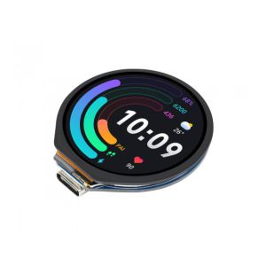

# RP2040-Touch-LCD-1.28



Rust boilerplate to support [RP2040-Touch-LCD-1.28](https://www.waveshare.com/wiki/RP2040-Touch-LCD-1.28)
from WaveShare.

Inspiration from :
* [esp32-s3-touch-lcd-1-28](https://github.com/IniterWorker/esp32-s3-touch-lcd-1-28)
* [embassy/examples/rp](https://github.com/embassy-rs/embassy/tree/main/examples/rp)
* https://files.waveshare.com/upload/1/16/RP2040-Touch-LCD-Code.zip
* https://files.waveshare.com/upload/1/16/RP2040-Touch-LCD-1.28-LVGL.zip
* ...

This is my personal learning journey to NixOs, Embedded Rust and Pico development, no guarantees what so ever

## Features

* Crate [`lvgl`](https://github.com/lvgl/lv_binding_rust)
* Crate [`shared-bus`](https://github.com/Rahix/shared-bus)
* Driver [`qmi8658`](https://github.com/IniterWorker/qmi8658) _accelerometer,pedometer,gyroscope_
* Driver [`cst816s`](https://github.com/IniterWorker/cst816s) _touch screen_

## Getting Started

### Using Nix-shell
```bash
nix-shell
cargo build
```

### Using Nix flake
```bash
nix develop
cargo build
elf2uf2-rs target/thumbv6m-none-eabi/debug/main
cp target/thumbv6m-none-eabi/debug/main.uf2 /run/media/pero/RPI-RP2/.
```

### Using Nix flake
```bash
nix develop
cargo build
elf2uf2-rs target/thumbv6m-none-eabi/debug/main
cp target/thumbv6m-none-eabi/debug/main.uf2 /run/media/pero/RPI-RP2/.
```

### Using probe-rs

```bash
cargo run
```

## License

Licensed under either of

- Apache License, Version 2.0 ([LICENSE-APACHE](LICENSE-APACHE) or
  http://www.apache.org/licenses/LICENSE-2.0)
- MIT license ([LICENSE-MIT](LICENSE-MIT) or http://opensource.org/licenses/MIT)

at your option.

### Contribution

Unless you explicitly state otherwise, any contribution intentionally submitted for inclusion in the
work by you, as defined in the Apache-2.0 license, shall be dual licensed as above, without any
additional terms or conditions.

# Features

* LCP SPI interface
* Simple Draw Image


* Backlight PWM

## Backlog
* Add Better Nix support
* Touch Sensor
  * Switch between demo pages with touch screen long press
* Accelometer
* Additional Demo Pages
  * Draw Random Letter
  * Draw Accelerometer Data
  * Touch Draw
  * Snake
  * Clock
* External Buttons
* Fix TODO:s in code
* How to generate *.raw data from images
* Rust support for vendoring